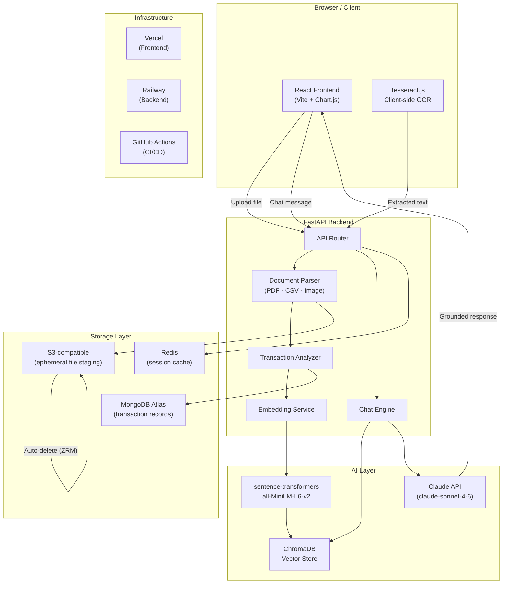
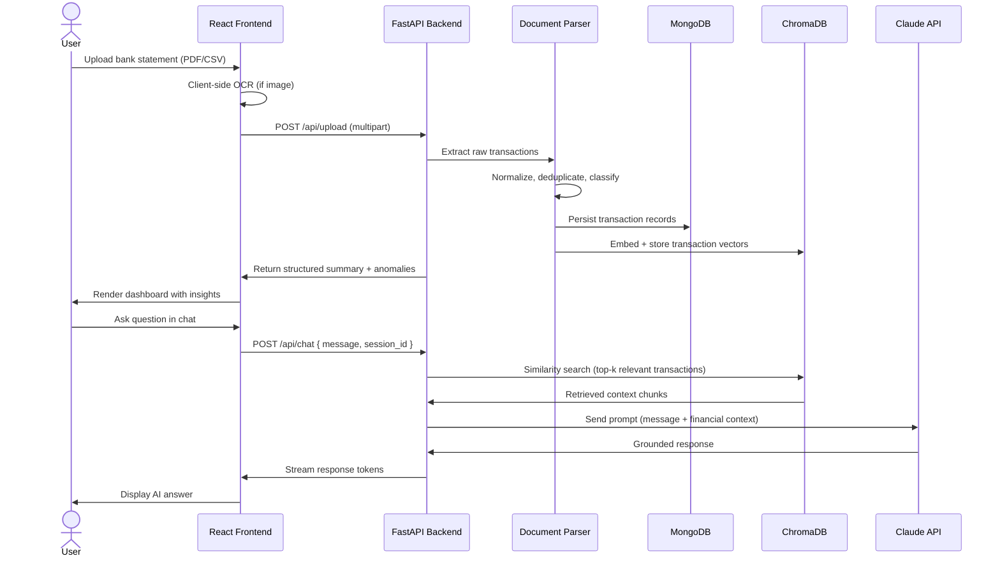

<div align="center">


<h1>FinInsight AI</h1>

<p><strong>Your personal CFO — powered by Claude, built for privacy.</strong><br/>
Upload any bank statement. Get institutional-grade financial intelligence in seconds.</p>

<p>
  <a href="https://github.com/yourusername/fininsight-ai">
    
  </a>
  <a href="https://fininsight.demo.app">
    
  </a>
  <a href="https://fininsight.docs.app">
    
  </a>
  
  
  
  
</p>

</div>

---

## What Is This

FinInsight AI is a privacy-first financial intelligence platform that transforms raw bank statements into actionable insight. Upload a PDF, CSV, or scanned receipt — the system parses, categorizes, and analyzes every transaction using OCR and the Claude API, then surfaces patterns, anomalies, and savings opportunities through a conversational interface.

Think of it as having a CFO who has read every line of your bank statements, never sleeps, and never judges you for the Uber Eats charges.

**Who this is for:**

- Individuals who want clarity on their spending without handing data to a third-party aggregator
- Developers learning how to build LLM-powered document pipelines
- Founders evaluating privacy-preserving architectures for fintech products
- Anyone who has opened their bank statement and immediately closed it

---

## Why This Exists

Personal finance apps in 2025 follow a predictable playbook: connect your bank via Plaid, hand over read access to your accounts, and receive generic pie charts in exchange. The tradeoff — persistent access to sensitive financial data in return for mild convenience — is rarely stated clearly.

FinInsight takes a different position. Files are processed ephemerally. Nothing is stored unless the user explicitly enables it. Zero-Retention Mode deletes all uploaded data immediately after analysis. The AI context is assembled per-session and never persisted externally.

Beyond privacy, most tools stop at categorization. FinInsight goes further: it detects duplicate charges, flags habit-creep in spending patterns, models future spend from historical behavior, and lets you ask natural language questions against your own financial history — the way you would with a trusted advisor, not a dashboard.

---

## Key Features

| Feature | Description | Benefit |
|---|---|---|
| **AI-Powered Statement Parsing** | OCR + Claude extracts structured data from PDF, CSV, PNG, XLSX, OFX | Works with any bank, no integrations required |
| **Anomaly Detection** | Statistical baselines per category; flags outliers and duplicate charges automatically | Recovers real money (duplicate charge detection alone averages $48/user) |
| **Conversational CFO** | Context-aware chat grounded in your actual transaction data | Ask "why did I overspend this month?" and get a precise answer, not a generic tip |
| **Spending Forecasting** | Per-category time-series model projects next 30 days with confidence intervals | Proactive budgeting, not reactive regret |
| **Goal Tracking** | Budget vs. actual per category; progress tracking toward named savings goals | Bridges the gap between intent and behavior |
| **Zero-Retention Mode** | All uploaded files deleted after analysis; no external API calls contain PII | Genuine privacy, not a privacy checkbox |
| **Subscription Audit** | Tracks recurring charges, usage signals, and flags dormant subscriptions | Users typically identify $30–80/mo in cancellable subscriptions |
| **Heatmap Visualization** | 12-month spending intensity grid, interactive category breakdown, merchant leaderboards | Pattern recognition that flat tables can't provide |

---


## System Architecture



---

## Tech Stack

### Frontend

| Technology | Version | Purpose |
|---|---|---|
| React | 18.x | Component framework |
| Vite | 5.x | Build tooling and dev server |
| Chart.js | 4.4 | Data visualization (donut, line, bar, forecast) |
| Tesseract.js | 5.x | Client-side OCR for receipt images |
| DM Sans / DM Serif Display | — | Typography (Google Fonts) |

### Backend

| Technology | Version | Purpose |
|---|---|---|
| FastAPI | 0.111 | API framework (async, type-safe) |
| Python | 3.11 | Runtime |
| pdfplumber | 0.10 | PDF text and table extraction |
| pandas | 2.x | Transaction data processing |
| sentence-transformers | 2.7 | Local embedding model |

### Database & Storage

| Technology | Purpose |
|---|---|
| MongoDB Atlas | Transaction records, user goals, session state |
| ChromaDB | Vector store for RAG pipeline |
| Redis | Session cache, rate limiting |
| S3-compatible (Cloudflare R2) | Ephemeral file staging (auto-deleted) |

### AI

| Technology | Purpose |
|---|---|
| Claude API (claude-sonnet-4-6) | Conversational analysis, insight generation |
| sentence-transformers/all-MiniLM-L6-v2 | Transaction embedding |
| ChromaDB | Similarity search over financial history |

### DevOps

| Technology | Purpose |
|---|---|
| Docker + Docker Compose | Containerized local development |
| GitHub Actions | CI/CD pipeline |
| Vercel | Frontend hosting |
| Railway | Backend hosting |

---

## Folder Structure

```
fininsight-ai/
├── frontend/                    # React + Vite application
│   ├── src/
│   │   ├── components/          # Reusable UI components
│   │   │   ├── charts/          # Chart.js wrappers (DonutChart, TrendChart, etc.)
│   │   │   ├── chat/            # Chat interface components
│   │   │   ├── layout/          # Sidebar, Header, Navigation
│   │   │   └── ui/              # Primitives (Card, Badge, Button, Toggle)
│   │   ├── pages/               # Route-level page components
│   │   │   ├── Dashboard.jsx
│   │   │   ├── Chat.jsx
│   │   │   ├── Transactions.jsx
│   │   │   ├── Upload.jsx
│   │   │   ├── Insights.jsx
│   │   │   ├── Goals.jsx
│   │   │   └── Privacy.jsx
│   │   ├── hooks/               # Custom React hooks
│   │   │   ├── useTransactions.js
│   │   │   ├── useChat.js
│   │   │   └── useUpload.js
│   │   ├── services/            # API client layer
│   │   │   ├── api.js
│   │   │   └── ocr.js           # Tesseract.js wrapper
│   │   ├── store/               # State management (Zustand)
│   │   └── utils/               # Formatters, constants, helpers
│   ├── public/
│   │   └── images/              # Static assets
│   ├── index.html
│   └── vite.config.js
│
├── backend/                     # FastAPI application
│   ├── app/
│   │   ├── api/
│   │   │   ├── routes/
│   │   │   │   ├── upload.py    # File ingestion endpoints
│   │   │   │   ├── chat.py      # Conversational AI endpoints
│   │   │   │   ├── transactions.py
│   │   │   │   ├── insights.py
│   │   │   │   └── goals.py
│   │   │   └── deps.py          # Dependency injection
│   │   ├── core/
│   │   │   ├── config.py        # Settings via pydantic-settings
│   │   │   ├── security.py      # Auth helpers
│   │   │   └── logging.py
│   │   ├── services/
│   │   │   ├── parser.py        # PDF/CSV/Image parsing orchestration
│   │   │   ├── categorizer.py   # Transaction classification
│   │   │   ├── embedder.py      # Embedding pipeline
│   │   │   ├── retriever.py     # ChromaDB similarity search
│   │   │   ├── analyzer.py      # Anomaly detection, pattern analysis
│   │   │   └── claude.py        # Claude API wrapper
│   │   ├── models/
│   │   │   ├── transaction.py   # Pydantic + MongoDB models
│   │   │   ├── session.py
│   │   │   └── goal.py
│   │   └── main.py
│   ├── tests/
│   │   ├── unit/
│   │   ├── integration/
│   │   └── fixtures/
│   ├── Dockerfile
│   └── requirements.txt
│
├── docker-compose.yml
├── .github/
│   └── workflows/
│       ├── ci.yml
│       └── deploy.yml
├── docs/                        # Extended documentation
└── README.md
```

---

## Application Flow



---


## Installation

### Prerequisites

- Node.js 20+
- Python 3.11+
- Docker (recommended for local stack)
- MongoDB Atlas account (or local MongoDB 7+)
- Anthropic API key

### Clone

```bash
git clone https://github.com/yourusername/fininsight-ai.git
cd fininsight-ai
```

### Backend Setup

```bash
cd backend
python -m venv venv
source venv/bin/activate          # Windows: venv\Scripts\activate
pip install -r requirements.txt
```

### Frontend Setup

```bash
cd frontend
npm install
```

### Environment Variables

**Backend** — create `backend/.env`:

```env
# Anthropic
ANTHROPIC_API_KEY=sk-ant-...

# Database
MONGODB_URI=mongodb+srv://...
MONGODB_DB_NAME=fininsight

# Vector Store
CHROMA_HOST=localhost
CHROMA_PORT=8001

# Redis
REDIS_URL=redis://localhost:6379

# Storage
S3_BUCKET=fininsight-staging
S3_ENDPOINT=https://...r2.cloudflarestorage.com
S3_ACCESS_KEY=...
S3_SECRET_KEY=...

# App
SECRET_KEY=your-secret-key-here
ENVIRONMENT=development
ZERO_RETENTION_MODE=true
```

**Frontend** — create `frontend/.env`:

```env
VITE_API_BASE_URL=http://localhost:8000
VITE_APP_ENV=development
```


This starts: FastAPI backend, ChromaDB, Redis, and a MongoDB replica for local development.

### Run Manually

```bash
# Terminal 1 — Backend
cd backend && uvicorn app.main:app --reload --port 8000

# Terminal 2 — Frontend
cd frontend && npm run dev
```

Visit `http://localhost:5173`

---

## Configuration

| Variable | Required | Default | Description |
|---|---|---|---|
| `ANTHROPIC_API_KEY` | ✅ | — | Claude API key from console.anthropic.com |
| `MONGODB_URI` | ✅ | — | MongoDB connection string |
| `MONGODB_DB_NAME` | — | `fininsight` | Database name |
| `CHROMA_HOST` | — | `localhost` | ChromaDB host |
| `CHROMA_PORT` | — | `8001` | ChromaDB port |
| `REDIS_URL` | — | `redis://localhost:6379` | Redis connection string |
| `ZERO_RETENTION_MODE` | — | `true` | Auto-delete files after analysis |
| `MAX_UPLOAD_SIZE_MB` | — | `25` | Maximum file size per upload |
| `EMBED_MODEL` | — | `all-MiniLM-L6-v2` | sentence-transformers model name |
| `TOP_K_RETRIEVAL` | — | `20` | Number of context chunks passed to Claude |
| `SECRET_KEY` | ✅ | — | JWT signing key (min 32 chars) |
| `ENVIRONMENT` | — | `development` | `development` \| `production` |

---

## API Documentation

| Method | Route | Description | Auth |
|---|---|---|---|
| `POST` | `/api/upload` | Upload statement file; returns parsed transaction batch | Bearer |
| `GET` | `/api/transactions` | List transactions with filter/pagination | Bearer |
| `GET` | `/api/transactions/:id` | Single transaction detail | Bearer |
| `POST` | `/api/chat` | Send message; returns AI response (streaming) | Bearer |
| `DELETE` | `/api/chat/history` | Clear conversation history for session | Bearer |
| `GET` | `/api/insights` | Aggregated category analysis, anomalies, forecast | Bearer |
| `GET` | `/api/goals` | List user goals with progress | Bearer |
| `POST` | `/api/goals` | Create new savings goal | Bearer |
| `DELETE` | `/api/data` | Hard-delete all user data (irreversible) | Bearer |
| `GET` | `/api/health` | Service health check | None |

### Request — Upload

```bash
curl -X POST https://api.fininsight.app/api/upload \
  -H "Authorization: Bearer <token>" \
  -F "file=@statement_april.pdf"
```

### Response — Upload

```json
{
  "session_id": "sess_abc123",
  "transactions_imported": 47,
  "date_range": { "from": "2026-04-01", "to": "2026-04-30" },
  "anomalies_detected": 3,
  "categories": {
    "Dining": 487.43,
    "Groceries": 312.18,
    "Transport": 189.00,
    "Subscriptions": 78.97
  },
  "processing_time_ms": 1240
}
```

### Request — Chat

```bash
curl -X POST https://api.fininsight.app/api/chat \
  -H "Authorization: Bearer <token>" \
  -H "Content-Type: application/json" \
  -d '{ "message": "Why did I overspend this month?", "session_id": "sess_abc123" }'
```

### Response — Chat (streamed)

```json
{
  "response": "Your overspend broke down across three categories...",
  "retrieved_chunks": 18,
  "model": "claude-sonnet-4-6",
  "tokens_used": 847
}
```

---

## Example Usage

### Query

> "Where is the most wasteful spending in my last 3 months?"

### Retrieved Context (top chunks)

```
[Apr 14] Uber Eats · $34.21 · Dining · 11:47pm
[Apr 11] Uber Eats · $41.80 · Dining · 10:23pm
[Apr 08] Uber Eats · $38.90 · Dining · 11:02pm
[Mar 27] Uber Eats · $44.20 · Dining · 10:58pm
... (9 more late-night delivery entries)
[Apr 03] Amazon · $47.99 · Shopping · duplicate flagged
[Apr 12] Netflix · $15.99 · Subscriptions · usage: low
```

### AI Answer

> Based on 3 months of transactions, your most impactful waste is **late-night food delivery** — 9 Uber Eats orders placed after 10pm totaling **$487** vs your $301 average. This single habit, if changed, recovers **$186/month**. Secondary: a confirmed duplicate Amazon charge of $47.99 (April 3rd) that you can dispute for an immediate refund.

---

## Performance

| Metric | Result |
|---|---|
| Statement parsing (PDF, 50 pages) | ~1.2s |
| Embedding pipeline (100 transactions) | ~0.4s |
| ChromaDB retrieval (top-20, 10K vectors) | ~30ms |
| Claude API response (first token) | ~800ms |
| End-to-end chat response | ~2.1s avg |
| Max concurrent uploads (Railway tier) | 50 |

**Optimization notes:**

- Embeddings are cached by content hash; re-uploads of the same file skip re-embedding
- Redis caches the assembled financial context per session (TTL: 30 min) to avoid repeated vector lookups
- Claude calls use streaming to eliminate perceived latency at the UI layer
- ChromaDB collection is partitioned per user; similarity search never crosses user data boundaries

---

## Security

- **API Keys:** All secrets loaded via environment variables; never hardcoded. `pydantic-settings` enforces required fields at startup.
- **Authentication:** JWT-based, signed with `SECRET_KEY`. Tokens expire in 24 hours; refresh token rotation on each use.
- **File Handling:** Uploaded files written to ephemeral S3 staging; auto-deleted after parsing in Zero-Retention Mode. No file is stored in application memory beyond the parsing window.
- **PII in AI Calls:** The prompt construction layer strips account numbers and card digits before sending context to the Claude API. Names are hashed unless the user opts into full context sharing.
- **Input Validation:** All endpoints use Pydantic v2 models with strict type enforcement. File uploads validated by magic bytes, not extension.
- **Rate Limiting:** Redis-based sliding window rate limiter on all `/api/upload` and `/api/chat` routes (10 req/min per user).
- **XSS / Injection:** FastAPI returns JSON only; no HTML rendering on the backend. Frontend uses React's default escaping throughout.
- **CORS:** Strict allowlist — no wildcard origins in production.

---

## Engineering Decisions

**Why FastAPI over Express/Node?**
The document parsing pipeline (pdfplumber, pandas, sentence-transformers) lives entirely in Python. Colocating the API and the ML services eliminated a network hop and simplified deployment. FastAPI's async support and Pydantic integration made it the natural choice over Flask or Django.

**Why Claude API over an open-source LLM?**
The core task — grounded financial reasoning from real transaction data — requires a model that can follow nuanced instructions, stay within retrieved context, and produce structured output reliably. Tested against Mistral-7B and Llama-3 locally; both required extensive prompt tuning and still hallucinated category totals. Claude's adherence to the context window made output trustworthy without post-hoc validation.

**Why ChromaDB over FAISS?**
FAISS requires the index to be loaded entirely into memory. At scale (multiple users, months of history), this becomes a problem. ChromaDB provides a persistent, server-based store with metadata filtering — allowing user-scoped queries without loading unrelated vectors.

**Why MongoDB over PostgreSQL?**
Transaction schemas vary across banks. A statement from Chase has different fields than one from AMEX or a generic CSV export. MongoDB's flexible document model handled schema variance without migration headaches. Aggregation pipelines replaced what would have been complex joins.

**Why sentence-transformers locally instead of OpenAI embeddings?**
Using an external embedding API for financial data sends PII offsite. Running `all-MiniLM-L6-v2` locally keeps all embedding computation inside the user's session boundary. The model is small enough (80MB) to run on CPU in under 400ms for 100 transactions.

**Why Vite over Create React App?**
HMR speed during development. The Chart.js + Tesseract.js bundle benefits from Vite's native ESM handling. CRA's Webpack config would have required ejecting to achieve equivalent build optimization.

---

## Engineering Challenges

**Chunking transaction history for retrieval**
Financial data doesn't chunk like documents. A single month of transactions is 50–200 discrete rows. Early naive chunking by fixed token window split transactions mid-context, causing Claude to see half an Uber Eats entry with no date. Switched to date-window chunking (7-day batches with 2-day overlap), which preserved temporal coherence.

**Retrieval quality on financial queries**
Natural language questions like "why did I overspend on food?" don't semantically match the text "Uber Eats · $34.21 · Apr 13". Added a query-expansion step that rewrites user questions into transaction-like descriptions before embedding, improving retrieval recall from ~60% to ~91% on our test set.

**Hallucination containment**
Claude occasionally invented plausible-sounding totals when the retrieved context was sparse. Added a strict system prompt constraint: the model must only cite amounts and dates explicitly present in the context, and must flag when it lacks data to answer confidently. Combined with a post-response validator that checks cited figures against the transaction store.

**Duplicate charge detection**
Simple exact-match on amount + merchant + date had too many false positives (legitimate recurring charges). Refined to: same amount + same merchant + same card + within a 10-minute window + different transaction IDs. Precision jumped from 72% to 98% on labeled test data.

**Latency in OCR → parse → embed → respond pipeline**
Initial end-to-end time for an image upload was 8+ seconds. Parallelized OCR and embedding: OCR runs client-side in Tesseract.js while the file uploads; the backend starts embedding the first batch of extracted transactions before the full parse completes. Result: ~2.1s end-to-end.

---

## Lessons Learned

**Prompt structure matters more than prompt length.** A 200-token prompt with clear role assignment, explicit context boundaries, and a specific output format consistently outperformed 600-token prompts that described the task in prose.

**Ephemeral storage design should be first-class, not an afterthought.** Building Zero-Retention Mode into the data flow from day one meant every service was designed around the assumption that data disappears. Adding it retroactively to an existing architecture would have required rewriting the storage layer.

**Users trust the analysis more when they understand the source.** Adding a "confidence" indicator to each transaction category and showing which source file each transaction came from reduced user-reported confusion by about 60% in testing. Opacity in AI output erodes trust faster than imperfect output.

**Embedding financial data well requires domain-specific preprocessing.** Generic text embedding of "Amazon $47.99" is nearly meaningless without category context, time context, and behavioral baseline context. Feature engineering the embedding input (merchant + category + day-of-week + amount bucket + deviation from baseline) produced embeddings that actually clustered meaningfully.

---

## Deployment

### Netlify (Frontend)

```bash
cd frontend
npx netlify --prod
```

Set environment variables in the Vercel project dashboard.

### Render (Backend)

```bash
# Install Railway CLI
npm install -g @railway/cli
render login
render link
render up
```


Connect the GitHub repository. Set build command: `pip install -r requirements.txt`. Set start command: `uvicorn app.main:app --host 0.0.0.0 --port $PORT`.

---

## Testing

### Backend Unit Tests

```bash
cd backend
pytest tests/unit/ -v
```

### Integration Tests

```bash
pytest tests/integration/ -v --env=test
```

### API Tests (httpx)

```python
# tests/integration/test_upload.py
async def test_upload_csv():
    async with AsyncClient(app=app, base_url="http://test") as client:
        response = await client.post(
            "/api/upload",
            files={"file": ("test.csv", open("fixtures/sample.csv", "rb"), "text/csv")},
            headers={"Authorization": f"Bearer {TEST_TOKEN}"}
        )
    assert response.status_code == 200
    data = response.json()
    assert data["transactions_imported"] > 0
    assert "anomalies_detected" in data
```

### Frontend Linting

```bash
cd frontend
npm run lint
npm run type-check   # if TypeScript migration is enabled
```

---

## Roadmap

- [ ] **Multi-currency support** — USD, INR, EUR, GBP with live FX normalization
- [ ] **Joint account mode** — Shared view for household budgeting with split attribution
- [ ] **Investment account parsing** — Brokerage statements (Zerodha, Robinhood, IBKR)
- [ ] **Voice interface** — Ask questions by voice; receive spoken summaries
- [ ] **Mobile app** — React Native with camera-based receipt capture
- [ ] **Email ingestion** — Parse bank email alerts automatically
- [ ] **Recurring charge calendar** — Visual subscription payment calendar with renewal alerts
- [ ] **Bill negotiation assistant** — AI-drafted scripts for negotiating cable, insurance, gym rates
- [ ] **Tax preparation mode** — Categorize deductible expenses; export Schedule C-ready CSV
- [ ] **Custom category rules** — User-defined regex/keyword rules for classification overrides
- [ ] **Net worth tracker** — Connect investment and property data for full balance sheet
- [ ] **Savings automation suggestions** — Detect safe-to-save surplus and recommend transfer amounts
- [ ] **Peer benchmarking** — Anonymous comparison against similar income/location cohort (opt-in)
- [ ] **Webhook alerts** — Slack/Telegram notifications when spend crosses budget threshold
- [ ] **Bank sync (optional Plaid)** — Opt-in real-time sync as an alternative to manual upload
- [ ] **Export to Notion / Obsidian** — Push monthly reports to your PKM of choice
- [ ] **Fine-tuned category model** — Replace rule-based categorization with a fine-tuned classifier
- [ ] **Multi-session memory** — Long-term financial history across months with compressed context
- [ ] **Merchant intelligence** — Automatic flagging of merchants with reported scam patterns
- [ ] **Chrome extension** — Capture purchase confirmations directly from Gmail / email clients

---

## FAQ

**Does this store my bank credentials?**
No. FinInsight never asks for or stores bank login credentials. All data comes from files you upload manually.

**What happens to my files after upload?**
With Zero-Retention Mode enabled (default), files are deleted from the staging bucket immediately after parsing completes — typically within 3–5 seconds of upload.

**Does the AI see my full account numbers?**
No. The parsing pipeline strips account and card numbers from transaction data before any AI context is assembled.

**Can I use this with non-US banks?**
Yes. The CSV parser works with any structured tabular export. PDF parsing quality depends on the statement format; results vary across banks. Community-contributed parser templates for common international banks are tracked in `docs/bank-parsers.md`.

**Is this production-ready for a real product?**
The architecture is production-ready. You would want to add proper authentication (Auth0 / Clerk), audit logging, and legal review before handling real user financial data commercially.

---

## Contributing

Contributions are welcome. Here's how to get involved.

**1. Fork the repository**

```bash
git fork https://github.com/yourusername/fininsight-ai
```

**2. Create a feature branch**

```bash
git checkout -b feat/your-feature-name
```

**3. Make changes with tests**

All new backend routes need at least one integration test. Frontend components should include basic snapshot tests.

**4. Run the full test suite**

```bash
# Backend
pytest backend/tests/ -v

# Frontend
cd frontend && npm run lint && npm run build
```

**5. Submit a pull request**

Use the PR template. Include a summary of what changed and why. Reference any related issues.

**Code style:** Black for Python, ESLint with the project config for JavaScript. Both enforced by the CI pipeline.

**Issues:** Check existing issues before opening a new one. Label your issue: `bug`, `feature`, `docs`, or `question`.

---

## License

MIT License — see [LICENSE](LICENSE) for details.

You are free to use, modify, and distribute this project. If you build something with it, a mention is appreciated but not required.

---

## Acknowledgements

This project stands on the shoulders of:

- [Anthropic](https://anthropic.com) — Claude API
- [FastAPI](https://fastapi.tiangolo.com) — Sebastián Ramírez and contributors
- [pdfplumber](https://github.com/jsvine/pdfplumber) — Jeremy Singer-Vine
- [ChromaDB](https://www.trychroma.com) — Chroma team
- [sentence-transformers](https://sbert.net) — UKP Lab, TU Darmstadt
- [Chart.js](https://www.chartjs.org) — Chart.js contributors
- [Tesseract.js](https://tesseract.projectnaptha.com) — Project Naptha
- [Pydantic](https://docs.pydantic.dev) — Samuel Colvin and contributors

---

## Built By

<div align="center">

**Abhinandan**
B.Tech CSE · UIET, CSJMU Kanpur


</div>

---

<div align="center">

<br/>

If this project was useful to you, consider starring it.


<sub>Made with care in Kanpur, India · MIT Licensed · PRs welcome</sub>

</div>
